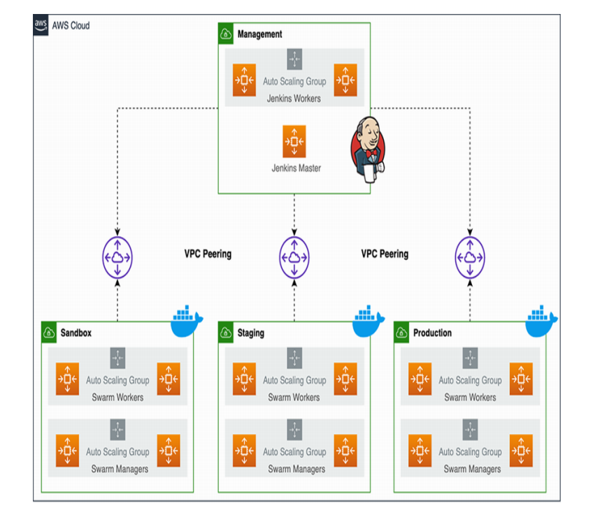

# Microservices CI/CD Platform on Docker Swarm using Jenkins Cluster

A production-style DevOps platform that demonstrates automated CI/CD pipelines for microservices deployment using a Jenkins cluster and a Docker Swarm cluster running on AWS.

This project showcases continuous integration, continuous delivery, container orchestration, dynamic build agents, load balancing, and highly available deployment practices commonly used in modern DevOps environments.

---

## 🔍 Project Overview

This platform is designed to:

- Automate application build and deployment workflows
- Provision dynamic Jenkins build agents
- Build and test containerized applications
- Push Docker images to Docker Hub
- Deploy microservices to Docker Swarm
- Perform rolling updates with minimal downtime
- Demonstrate production-grade DevOps architecture

---

## 🏗️ Architecture



### Key Components

#### Jenkins Infrastructure

- Jenkins Controller
- Dynamic Jenkins Agents
- Jenkins Pipelines
- GitHub Webhooks

#### Container Platform

- Docker Swarm Manager
- Docker Swarm Worker Nodes
- Overlay Networking
- Service Discovery

#### Application Layer

- Frontend Microservice
- Backend Microservice

#### Registry & Source Control

- GitHub Repository
- Docker Hub Registry

#### Cloud Infrastructure

- AWS EC2 Instances
- Application Load Balancer (ALB)
- Custom AMIs

---

## ⚙️ Infrastructure Design

### Jenkins Cluster Layer

The Jenkins cluster consists of:

- Dedicated Jenkins Controller
- Dynamic EC2 Build Agents
- Automated Pipeline Execution

Responsibilities:

- Source Code Management
- Continuous Integration
- Automated Testing
- Docker Image Builds
- Deployment Automation

### Docker Swarm Layer

The Docker Swarm cluster provides:

- Container Orchestration
- Service Scheduling
- Load Balancing
- Rolling Updates
- High Availability

Benefits:

- Simplified Deployments
- Horizontal Scalability
- Self-Healing Services
- Efficient Resource Utilization

### Application Layer

Applications are deployed as Docker Swarm services.

Advantages:

- Independent Service Management
- Container Isolation
- Easy Scaling
- Faster Releases

---

## 🔄 CI/CD Workflow

1. Developer pushes code to GitHub.
2. GitHub webhook triggers Jenkins Pipeline.
3. Jenkins Controller provisions a build agent.
4. Source code is checked out from GitHub.
5. Automated tests are executed.
6. Docker images are built.
7. Images are pushed to Docker Hub.
8. Jenkins connects to Docker Swarm Manager.
9. Swarm services are updated.
10. Rolling deployment is performed.
11. Application becomes available through the Load Balancer.

---

## 🛡️ Security Features

- Jenkins Credentials Management
- SSH-Based Deployment
- Docker Hub Authentication
- Isolated Overlay Networks
- Security Group Access Control
- Controlled Service Communication
- Private Internal Cluster Networking

---

## ☁️ AWS Resources Used

- Amazon EC2
- Application Load Balancer (ALB)
- Security Groups
- Custom AMIs
- Elastic IPs
- VPC Networking

---

## 🐳 Docker Components

- Docker Engine
- Docker Swarm
- Docker Services
- Docker Stacks
- Overlay Networks
- Docker Hub Registry

---

## 🛠️ Technology Stack

### DevOps

- Jenkins
- Docker
- Docker Swarm
- GitHub

### Cloud

- AWS EC2
- AWS ALB

### Programming

- Shell Scripting
- YAML

### Operating System

- Ubuntu Linux

---

## 📂 Project Structure

```text
.
├── jenkins-ami/
├── jenkins-cluster/
├── swarm-ami/
├── swarm-cluster/
├── Microservice-CI-CD-Pipeline/
├── diagram.png
└── README.md
```

### Directory Description

#### jenkins-ami/

Contains configuration and setup files used to create reusable Jenkins Agent AMIs.

#### jenkins-cluster/

Infrastructure and deployment configuration for the Jenkins Controller and dynamic build agents.

#### swarm-ami/

Contains Docker Swarm node image configurations used for rapid cluster provisioning.

#### swarm-cluster/

Configuration files and scripts used to create the Docker Swarm Manager and Worker Nodes.

#### Microservice-CI-CD-Pipeline/

Application source code and Jenkins pipeline definitions used for automated CI/CD workflows.

---

## 📚 Learning Outcomes

This project helps demonstrate:

- Jenkins Cluster Architecture
- Dynamic Build Agent Provisioning
- CI/CD Pipeline Automation
- Docker Image Management
- Docker Swarm Orchestration
- Rolling Deployment Strategies
- Infrastructure Design on AWS
- Load Balancing Concepts
- Production DevOps Workflows
- High Availability Deployments

---

## 🎯 Project Highlights

- Jenkins Controller with Dynamic Agents
- GitHub Webhook Integration
- Automated Docker Image Builds
- Docker Hub Registry Integration
- Docker Swarm Cluster Deployment
- Rolling Service Updates
- AWS-Based Infrastructure
- Production-Oriented Architecture

---

## 👤 Dev

**Vaibhav Umbarkar**

DevOps | AWS | Jenkins | Docker | Docker Swarm | CI/CD